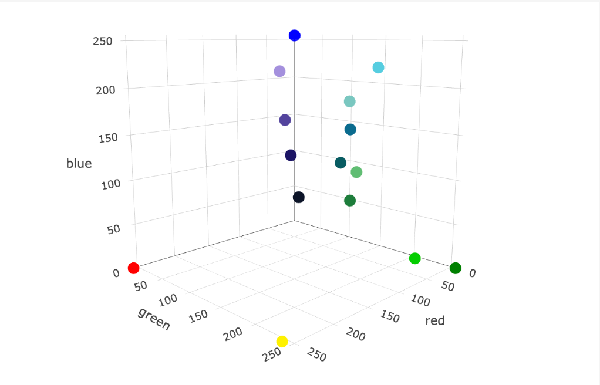
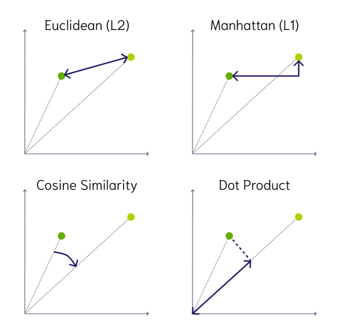
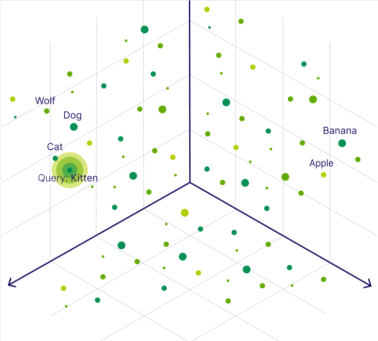
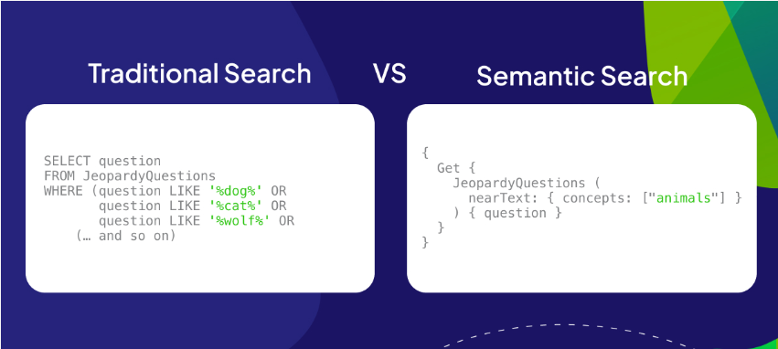
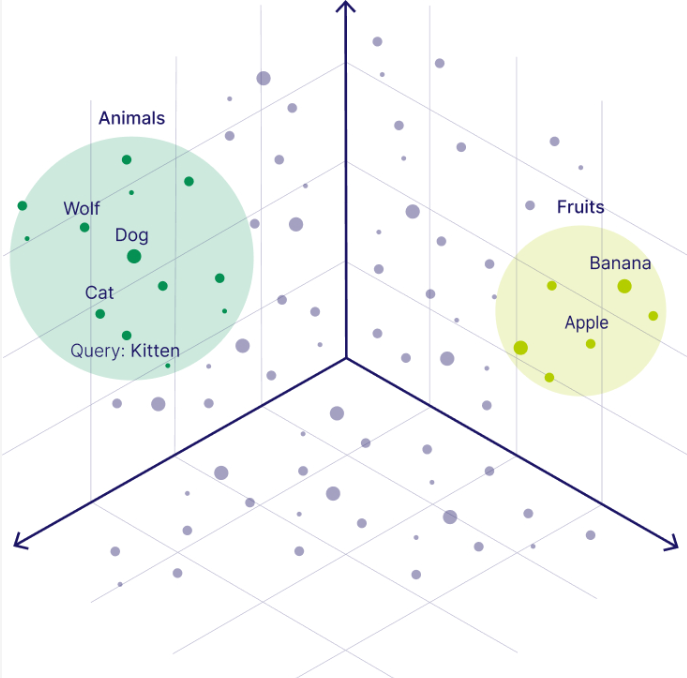

# Vector Database

A **vector database** indexes, stores, and provides access to structured or unstructured data (e.g., text, images) alongside its **vector embeddings**, which are numerical representations of that data. These databases allow users to efficiently find and retrieve similar objects at scale in production environments.

## What is a Vector Database?

A vector database, sometimes called a **vector search engine**, uses machine learning models to represent various types of data as vectors. These vectors preserve the meaning of the data and enable similarity search, allowing for fast retrieval of related objects based on their vector proximity.

### Core Features
- **Vector Embeddings**: Represent unstructured data (e.g., text, images) as vectors that capture semantic meaning.
- **Similarity Search**: Perform searches by identifying objects close in vector space, enabling semantic search beyond keyword matching.
- **High-Dimensional Data**: Supports searches across large-scale datasets with vectors that can have tens, hundreds, or thousands of dimensions.

## How Do Vector Databases Work?

Vector databases translate human-understandable data (text, images, etc.) into machine-readable vectors using **embedding models**. These vectors capture the relationships and semantic meaning of the data. Once embedded, the database enables **vector search** to retrieve related objects.

For example:
- A text query like "family vacation in Prague" is converted into a vector.
- The database retrieves relevant objects, such as vacation photos or documents describing the trip.

## Vector Embeddings

Vector embeddings numerically represent data. For structured data, this is straightforward, but **unstructured data** (e.g., images, text) is harder to quantify. AI models help convert this data into vectors, preserving its meaning.

Example: RGB color values, where [6, 205, 0] represents a specific shade of green. Similarly, more complex data such as words or text can be converted into vectors using machine learning models.

## Search Types: Vector Search and Hybrid Search

### Vector Search

In **vector search**, the database retrieves objects based on the proximity of their vector embeddings. Common **distance metrics** used to measure the similarity between vectors include:

- **Cosine Similarity**: Measures the cosine of the angle between two vectors. Vectors pointing in the same direction have a cosine similarity of 1, while those pointing in opposite directions have a similarity of -1. This is ideal for text-based embeddings.
  
- **Euclidean Distance**: The straight-line distance between two vectors in a multidimensional space. It’s often used when the magnitude of vectors is significant.

- **Dot Product**: Calculates the product of vector magnitudes and the cosine of the angle between them. It’s commonly used for recommendation systems to measure similarity.

Each distance metric offers different advantages depending on the use case. For example, **cosine similarity** is typically better for text-based searches, where the direction of the vector matters more than its magnitude, while **Euclidean distance** may be more appropriate for image or audio data where magnitude is essential.

### Hybrid Search

**Hybrid search** combines traditional keyword search with vector search, enabling a more flexible search experience. This is particularly useful when dealing with large amounts of data where both keyword relevance and semantic meaning are important.

#### How Hybrid Search Works:
- **Keyword Search**: Traditional keyword search looks for exact matches or fuzzy matches in the database. It is useful when you need to retrieve data that contains specific terms.
  
- **Vector Search**: Vector search compares the similarity of objects by their vector embeddings, enabling the retrieval of semantically similar objects.

In hybrid search, these two methods are combined. For example, when you search for "best wireless headphones," hybrid search can rank results based on the occurrence of the exact phrase (keyword search) while also considering semantically related terms like "Bluetooth earphones" or "noise-canceling earbuds" (vector search).
**Advantages of Hybrid Search**:
- **Precision**: It narrows down results based on exact keyword matches.
- **Relevance**: It enhances search quality by identifying objects with similar meanings, even if they don't contain the exact keywords.
- **Error Tolerance**: It is more robust against typos or synonyms, retrieving relevant results even if there are slight variations in wording.

Hybrid search is often used in domains where keyword matches are important but the searcher's intent needs to be inferred, such as e-commerce platforms, legal document databases, or medical research repositories.

## Vector Search Metrics

Different **distance metrics** can be used to measure the similarity between vectors. These include:

- **Squared Euclidean Distance**: Calculates the straight-line distance between two vectors.
- **Manhattan Distance**: Calculates the sum of the absolute differences between vector coordinates.
- **Cosine Similarity**: Measures the cosine of the angle between two vectors, commonly used for text data.
- **Dot Product**: Measures similarity by calculating the product of the vector magnitudes.
- **Hamming Distance**: Counts the number of differences between two vectors.

## Vector Indexing for Efficient Search

A **brute force** approach to similarity search compares every vector in the database, which is resource-intensive. To optimize performance, vector databases use **Approximate Nearest Neighbor (ANN)** algorithms, which pre-organize vectors for faster search.

## Use Cases

Vector databases have a wide range of applications:
- **Search Engines**: Power recommendation systems, content retrieval, and semantic search.
- **Generative AI**: Store long-term memory for LLMs (large language models) to enable continuous conversations.
- **Recommendation Systems**: Find similar products, movies, songs, or other items based on user preferences.

## Vector Database Architecture

- **Vector Indexing**: Organizes vectors for fast retrieval.
- **Similarity Measures**: Calculates the similarity between vectors using metrics like Euclidean distance or cosine similarity.
- **ANN Algorithms**: Optimize search performance, reducing computational load for large datasets.

## Tool Comparison

- **Vector Database**: Stores and retrieves vector embeddings efficiently, supports large-scale, real-time searches.
- **Traditional Database**: Optimized for structured data, lacks semantic search capabilities.
- **Vector-Capable Database**: Adds vector support to traditional databases, but may lack indexing performance for large-scale search.
- **Vector Libraries**: In-memory solutions for fast vector search, but with limitations in scalability and updatability.

## FAQs

### Why Use a Vector Database?

Vector databases manage large-scale unstructured data more efficiently than traditional databases, enabling **real-time semantic search**. They are essential for AI-driven applications like **recommendation systems**, **LLM memory management**, and **retrieval-augmented generation**.

### How to Use a Vector Database?

1. **Store vector embeddings**: Convert data into vectors using machine learning models.
2. **Index the vectors**: Use vector indexing for efficient retrieval.
3. **Perform similarity search**: Find relevant objects based on vector proximity.

### How to Choose a Vector Database?

Consider factors such as:
- **Search latency**
- **Scalability**
- **Memory footprint**
- **Integration with AI workflows (e.g., language models)**

---

For more details, contact me at [Karouswissem@gmail.com](mailto:karouswissem@gmail.com) or reach out to me on [LinkedIn](https://www.linkedin.com/in/wissem-karous/)

